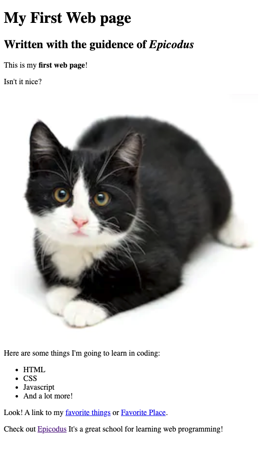

# _My First Website Project_

#### _Its our first website project, 03/17/20_

#### By _**Sean D. Haydee L.**_

## Description

_{This website is about my life and lists some of my favorite things. This site hosts two html pages in HTML. Back in March of 2020, Haydee and I paired up to read and learn about HTML & CSS. This effort was done in our very first week with Pair Programming}_

## Setup/Installation Requirements

Method 1
* Download and unzip
* Open indexd.html with any browser (except IE)

Method 2
* In your terminal, run git clone https://github.com/SPdowns/my-first-website
* Navigate to my-first-webpage directory
* open index.html with Lynx or w3m Text-Based Web Browser

_{Leave nothing to chance! You want it to be easy for potential users, employers and collaborators to run your app. Do I need to run a server? How should I set up my databases? Is there other code this app depends on?}_

## Known Bugs

_{None at this time}_

## Support and contact details

_{If running into issues; please feel free to contact
SeanD@mail.com
HaydeeL@mail.com}_

## Technologies Used

_{Created with VSCode}_

### License

*{This software is licensed under the MIT License and nothing else}*

Copyright (c) 2020 **_{Sean D, Haydee L}_**